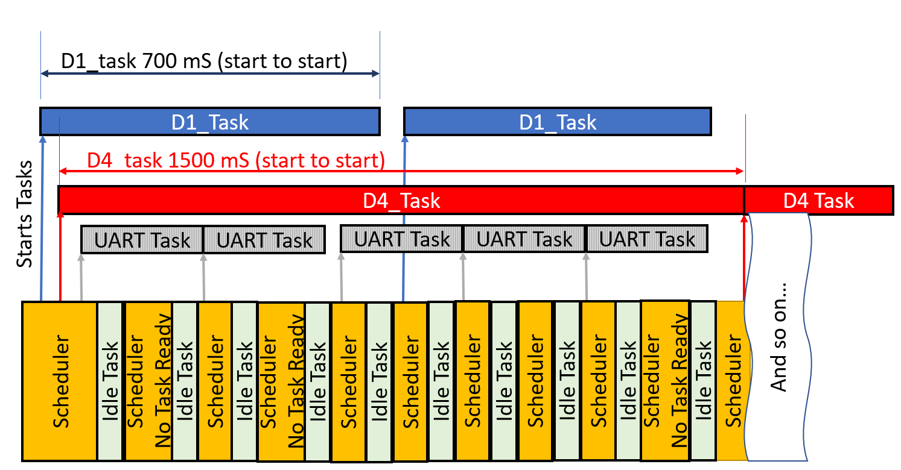
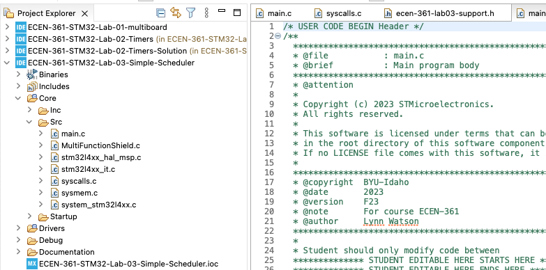
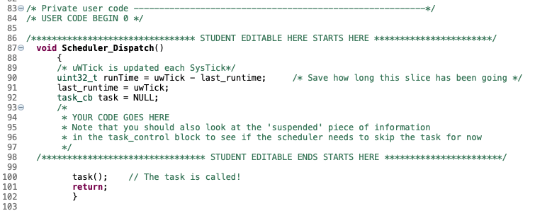
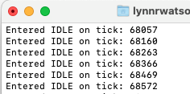
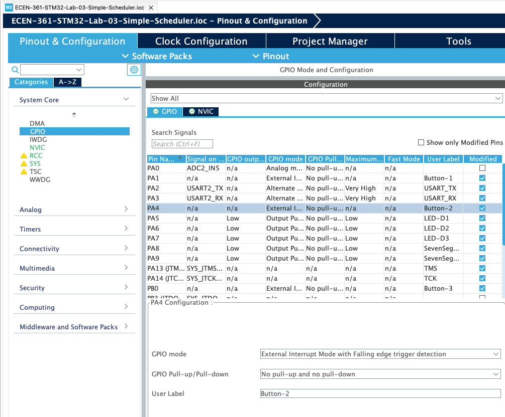

# Lab-03: Writing a Simple Scheduler

## Introduction

In this lab you will create a scheduler on your Nucleo-476RG that will execute three tasks at predetermined rates. To do this you will create a scheduler. A scheduler is a set of code that keeps a queue of possible processes/threads/tasks (we’ll say “**task**” here) and decides which of these should be executed at what time on the processor.

In order to keep this simple you will not be implementing a pre-emptive scheduler. A pre-emptive scheduler is a scheduler that can interrupt a task in the middle of execution, save the context (Program Counter/Stack Pointer/Register States), run the scheduler to decide with task should have time on the processor, and then restore that task, then continuing running it.

In this non-pre-emptive scheduler, each task runs and will continue until it is done completed, then the scheduler will determine which task should run next. This scheduler allows the processes to be started at different intervals and seemingly run in parallel. In the scaffolding code provided, there are three tasks written to be run at setup (times can be easily changed:

1. **D1 task**  every 700 mSec

2. **D4 task** every 1500 mSec

3. **Serial Port (UART) Write** every 2000 mSec
   
   **Idle task** runs in-between

When the scheduler runs it will look for any task that should be run (according to its defined start time).

The scheduler will choose the first one in the queue. When that task is run, the scheduler checks to see if it’s time for the next one in the queue, and will run that, … , etc. until none are left ready to run. The scheduler will then go into an idle task.

Note that you’re not writing a true scheduler with the ability to ‘suspend’ a given task and then swap to another. This scheduler simply starts the tasks on a pre-defined schedule. Each of the tasks must start and then return to the scheduler. We’re not saving task state (“task control block”) information or doing anything like a context switch. For this reason, the tasks have been written to be a simple LED toggle: Toggle the LED and return and wait for the scheduler to come back and toggle again.

### Implementation

Like all schedulers, a ‘slice’ of time to run a task and look for the next task has to be provided. This is done here, like most, with a Timer Interrupt. The STM32 comes pre-configured with a timer designated to be used as the SYSTICK time slicer. This timer updates an absolute count that keeps track of the number of SysTick (1 milliSecond) clocks since the processor started. The global HAL variable “**uwTick**” increments once every 1mS.

### Setup

Follow the same procedure as previous labs, accepting then cloning the repo from the GitHub classroom (link in the Canvas Assignment). Clean and Build the Project.

There should be no errors or warnings.

As always, source code is in **Core/Src/main.c**

## Lab Activities (6 pts)

Write the remainder of the **Scheduler_Dispatch()** code (about line 80 in **main.c**).

This will be completed by creating a loop to go through the task queue and seeing if it’s time to run the task being inspected. Remember to take into consideration the ‘**suspended’** field in deciding if it should be run or not. Any code written must be between the “EDITABLE” fields, and don’t modify lines outside of there. The lines outside are generated by the STM32 .IOC GUI to setup the controller.

  
You’ll be able to verify operation with 3 different output:

- LED_D1 and LED_D4 lights blinking at their appropriate rates.

- The far left and far right 7-Segment displays will count from 0-9 and 0-5 just showing the countups

- The terminal emulator output will show
  
  Output streaming **uwTICK** value each IDLE

If you have difficulty seeing the serial communication coming through a terminal emulator, contact a T/A or Instructor.

1. Verify that the **S1** (GPIO pin is called Button_1) switch suspends **D1_task** blinking process. Note that it stops at the same state (on or off).
2. Add an interrupt for **S2**. This will be a second ISR, that does the same thing for **D4_task**. To add this interrupt, you’ll first need to edit the “.IOC” setup file. In the GUI, go to the System Configuration/GPIO/ and tag the pin to be an interrupt:
   

Saving and closing this view will re-generate your **main.c**. You can then modify the **HAL_GPIO_EXTI_Callback()** routine to match the S1 interrupt as appropriate.

## Questions

1. List a shortfall that makes this method not a true ‘scheduler’? [*answer here*]
   So as stated earlier in the lab, this is not a true scheduler as it doesn't interrupt a task to run a higher priority one, also known as a pre-emptive task. It also doesnt do context switching, which means returning to the old task after the higher priority task is done. It's a non-preemptive scheduler, which means it lets the first task complete before going on to the next task, as seen with the LED's. Each LED gets the full alloted time to blink, without one overriding the other.

3. Was there any priority built into this system?
   No. as stated in the previous problem, there is no priorities carried by the system, it runs in the order that the task_control array was written. It runs on implicit priority where the ones that come first in the queue are executed first and get their full time to shine without interruption.

5. Are the variables in the processes (D1_task and D4_task) local or global?   How do you tell and why would either be used or must be used?
   The variables are global, since in the C language, you can tell the difference because global variables are declared outside of the main body and local variables are stored inside of it because local variables are only meant to run inside of the program, whereas global variables are meant to be kept for multiple programs without being erased after program is terminated.

7. For the interrupts on Button_1/2, why were the GPIO modes set to be Falling edge trigger?
   A falling edge trigger means that the switch becomes active low when the button is pushed(connecting it to ground). In this case, the button press signals an interrupt, which is what we want to happen in the case of a scheduler, rather than an interrupt occuring when we let go of the button, which just wouldn't make much sense. When I press the button I want my input registered as an interrupt.

void D1_Task(void) {
    HAL_GPIO_TogglePin(LD2_GPIO_Port, LD2_Pin); // Toggle D1 (LD2)
}

void D4_Task(void) {
    HAL_GPIO_TogglePin(GPIOB, GPIO_PIN_3); // Toggle D4 (PB3)
}

void UART_Task(void) {
    char msg[50];
    sprintf(msg, "uwTick: %lu\r\n", uwTick);
    HAL_UART_Transmit(&huart2, (uint8_t*)msg, strlen(msg), 1000);
}

void Idle_Task(void) {
    // Simulate 7-segment display with counters
    left_display = (left_display + 1) % 10;  // 0-9
    right_display = (right_display + 1) % 6; // 0-5
    char msg[50];
    sprintf(msg, "Idle - Display: %d%d, uwTick: %lu\r\n", left_display, right_display, uwTick);
    HAL_UART_Transmit(&huart2, (uint8_t*)msg, strlen(msg), 1000);
}

void Scheduler_Dispatch(void)
{
    task_cb task = NULL;
    int task_found = 0;

    for (int i = 0; i < TASK_COUNT - 1; i++) { // Skip idle task
        uint32_t elapsed = uwTick - task_control[i].last_run;
        if (elapsed >= task_control[i].period && task_control[i].suspended == 0) {
            task = task_control[i].task_func;
            task_control[i].last_run = uwTick; // Update last run time
            task_found = 1;
            break;
        }
    }

    if (!task_found) {
        // Run idle task if no other tasks are ready
        uint32_t elapsed = uwTick - task_control[IDLE_TASK].last_run;
        if (elapsed >= task_control[IDLE_TASK].period) {
            task = task_control[IDLE_TASK].task_func;
            task_control[IDLE_TASK].last_run = uwTick;
        }
    }

    if (task != NULL) {
        task(); // Execute the task
    }
}

/* Handle button interrupts (S1 and S2) */
void HAL_GPIO_EXTI_Callback(uint16_t GPIO_Pin) {
    if (GPIO_Pin == B1_Pin) { // S1 (PC13)
        task_control[D1_TASK].suspended = !task_control[D1_TASK].suspended; // Toggle suspend state
    }
    else if (GPIO_Pin == GPIO_PIN_0) { // S2 (PA0)
        task_control[D4_TASK].suspended = !task_control[D4_TASK].suspended; // Toggle suspend state
    }
}
/* USER CODE END 4 */

## Extra Credit (5 pts maximum)

1. Use the 3rd button (S3) to alter the time of a task’s execution.  For example, each S3 press increases/decreases the delay by 300mS.

2. Add input from the user via the TTY terminal to adjust the times

3. Suspend one of the processes after it’s run a pre-set number of times

4. Put out a message when either/both of the buttons are pressed and the processes suspended.  If both are suspended, quit putting out TTY messages.

   if (GPIO_Pin == GPIO_PIN_14) {  
    task_control[D1_TASK].period += 300;  // raise period by 300ms
    if (task_control[D1_TASK].period > 3000)  // upper bound
        task_control[D1_TASK].period = 500;   // reset to minimum
}

Heres the UART config:
char rx_buffer[20];
HAL_UART_Receive_IT(&huart2, (uint8_t*)rx_buffer, 10);

Here:s the callback function:
if (GPIO_Pin == B1_Pin) {  // button 1
    task_control[D1_TASK].suspended = !task_control[D1_TASK].suspended;
    char msg[50];
    sprintf(msg, "D1 %s\r\n", task_control[D1_TASK].suspended ? "suspended" : "resumed");
    HAL_UART_Transmit(&huart2, (uint8_t*)msg, strlen(msg), 1000);
} else if (GPIO_Pin == GPIO_PIN_0) {  // Button_2
    task_control[D4_TASK].suspended = !task_control[D4_TASK].suspended;
    char msg[50];
    sprintf(msg, "D4 %s\r\n", task_control[D4_TASK].suspended ? "suspended" : "resumed");
    HAL_UART_Transmit(&huart2, (uint8_t*)msg, strlen(msg), 1000);
}
// Check if both are suspended
if (task_control[D1_TASK].suspended && task_control[D4_TASK].suspended) {
    both_suspended = 1;
} else {
    both_suspended = 0;
}

PuTTY then shows "D1/D4 suspended" or it shows "D1/D4 resumed" when the button gets pressed and when both are suspended it stops outputting
